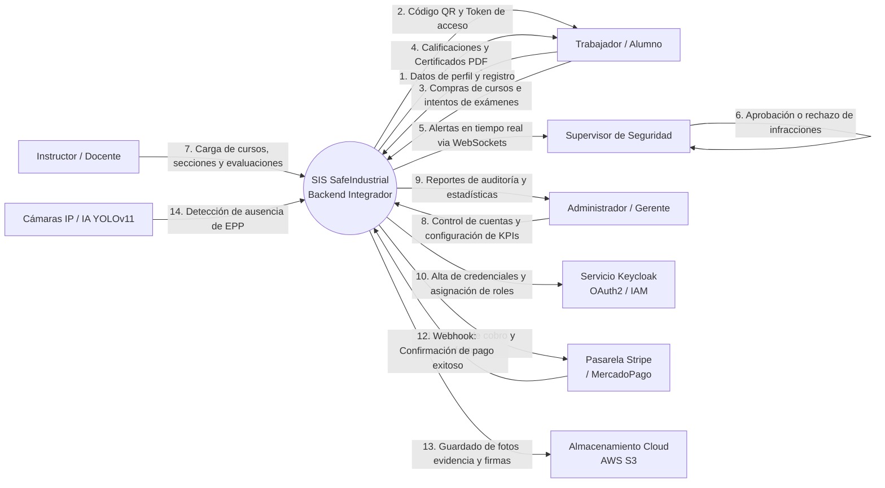
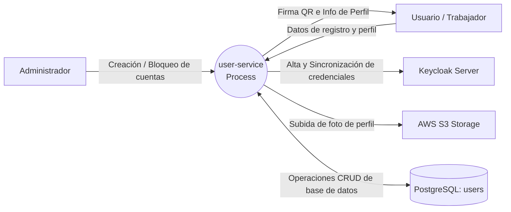
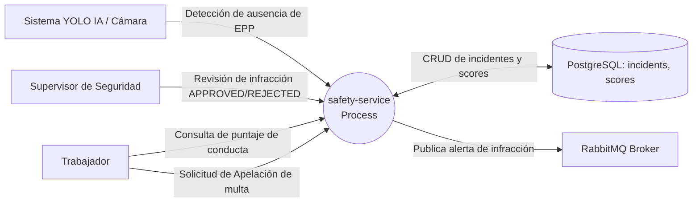
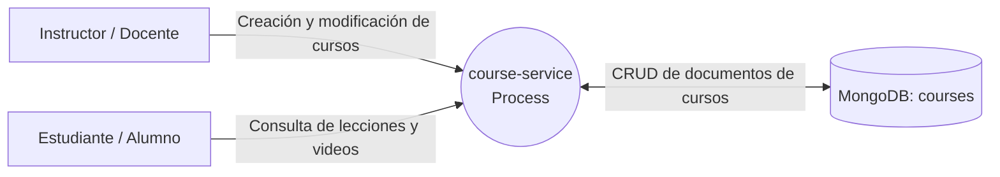
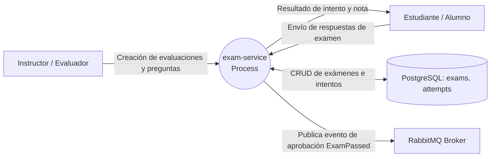
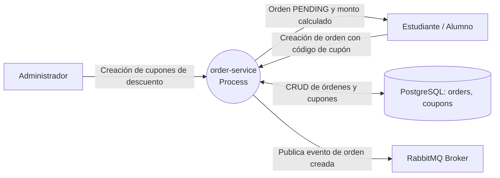
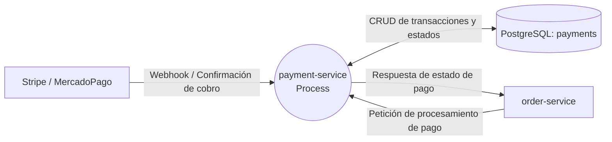
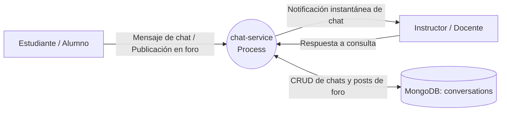
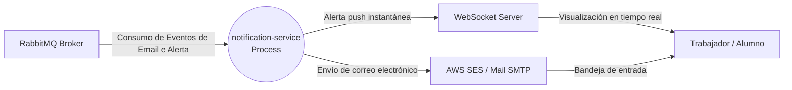
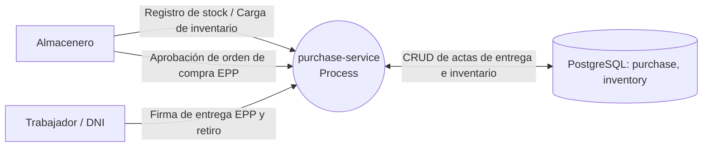

# 3.1.6. Diagramas de Arquitectura del sistema

Esta sección fundamenta y sustenta los diagramas de la arquitectura del sistema **Industrial Safety & Security Platform**, detallando de manera visual y descriptiva la correspondencia entre los microservicios, los actores externos, el flujo de datos (MVC), el transporte de información (DTO), el acceso a la persistencia (DAO/Repositorio) y los principios SOLID.

Siguiendo las mejores prácticas académicas y profesionales de ingeniería de software, los diagramas se representan bajo el formato de **Diagrama de Flujo de Datos (DFD) de Nivel 0 / Diagrama de Contexto**, el cual sitúa a cada componente como un proceso centralizado rodeado de sus entidades y flujos de datos externos. 

Adicionalmente, cada diagrama está sustentado por una fundamentación teórica y técnica que justifica su diseño y correspondencia con el código fuente en la rama de pruebas (`pruebas`).

---

## 1. Diagrama de Contexto de la Arquitectura General del Sistema

Este diagrama consolida la interacción global de la plataforma, situando al backend integrador como un proceso centralizado que interactúa con los distintos actores (Trabajador, Supervisor, Instructor, Administrador) y con los sistemas y servicios externos (Keycloak, pasarelas de pago, almacenamiento cloud y cámaras IA).

**Justificación General:** La plataforma está diseñada bajo un estilo arquitectónico de microservicios acoplados de forma asíncrona mediante un bus de mensajería (RabbitMQ) y unificados tras una puerta de enlace (`api-gateway`). El diagrama general demuestra el flujo de datos bidireccional que integra la lógica del negocio de capacitación industrial y el monitoreo activo de seguridad física de la mina o planta, separando las responsabilidades operacionales de cada tipo de usuario y servicio externo.

---

## 2. Diagramas de Contexto por Microservicio de Negocio

A continuación, se presenta y fundamenta el diagrama de contexto de nivel 0 para cada uno de los **9 microservicios funcionales** del backend, detallando su correspondencia con el código, persistencia y pruebas.

### 2.1. Microservicio `user-service`

Este microservicio encapsula el control de acceso, perfiles de usuario y la generación del código QR identificativo.

**Fundamentación Técnica:** Implementa el patrón MVC al exponer endpoints seguros a través del controlador `UserController`. Utiliza DTOs (`UserRequest`, `UserResponse`) mapeados con MapStruct para aislar la entidad `User` (JPA Entity), cumpliendo con el principio de responsabilidad única (SRP). Sus operaciones DAO se gestionan mediante el repositorio `UserRepository` conectado a PostgreSQL. Su persistencia e integración con Keycloak se validan en pruebas de integración (`UserControllerIT`) usando Testcontainers, logrando una cobertura superior al 80% requerida en la rama `pruebas`.

---

### 2.2. Microservicio `safety-service`

Responsable del núcleo de seguridad y monitoreo de EPP, administrando las infracciones registradas por cámaras y calculando el puntaje conductual.

**Fundamentación Técnica:** El patrón MVC separa el controlador de incidentes del servicio de puntuación (`IncidentServiceImpl`). Usa DTOs (`CreateIncidentRequest`, `IncidentResponse`) para ocultar los identificadores internos del sistema y la base de datos PostgreSQL. Sigue el principio SOLID de inversión de dependencias (DIP) inyectando mediante Spring `IncidentRepository` y `WorkerComplianceScoreRepository`. Su robustez está probada con pruebas unitarias (`IncidentServiceImplTest`) y de integración con Testcontainers, controlando la lógica de deducción de puntos y apelaciones.

---

### 2.3. Microservicio `course-service`

Gestiona el catálogo de formación técnica en seguridad industrial y las lecciones del personal.

**Fundamentación Técnica:** Su persistencia se apoya en un motor NoSQL (MongoDB), lo que le permite estructurar cursos con secciones anidadas y requisitos dinámicos representados en el documento `Course`. Sigue el patrón MVC y usa mappers automáticos (`CourseMapper`) para transformar DTOs de entrada sin exponer la estructura JSON nativa de MongoDB. Sus operaciones DAO se gestionan mediante `CourseRepository` que extiende de `MongoRepository`. Cumple SOLID a través de la segregación de interfaces (ISP) y se valida con pruebas MockMvc asegurando la consistencia de caché y consultas rápidas.

---

### 2.4. Microservicio `exam-service`

Ejecuta el proceso de evaluación teórica de los trabajadores y emite certificaciones digitales al aprobar.

**Fundamentación Técnica:** Su lógica MVC separa el controlador `ExamController` de la lógica de evaluación y calificación de intentos en `ExamServiceImpl`. Utiliza DTOs para estructurar las preguntas y respuestas enviadas por el alumno. El acceso a datos (DAO) se realiza mediante `ExamRepository` y `StudentAttemptRepository` mapeados en PostgreSQL. Cumple SOLID (LSP y SRP) al separar la calificación del intento de la generación del certificado digital. Su lógica se asegura mediante un estricto conjunto de pruebas de integración con bases de datos efímeras levantadas por Testcontainers.

---

### 2.5. Microservicio `order-service`

Procesa las órdenes de compra de cursos de capacitación y la validación de cupones de descuento.

**Fundamentación Técnica:** El patrón MVC desacopla el procesamiento de transacciones financieras. Utiliza DTOs (`OrderRequest`, `OrderResponse`) para blindar el modelo de datos relacional de la orden. Sus repositorios `OrderRepository` y `CouponRepository` (DAO) manejan la persistencia en PostgreSQL con soporte para transacciones. Sigue SOLID (SRP) al delegar la ejecución del pago en otro servicio y el control de cupones en `CouponServiceImpl`. Sus pruebas unitarias y de integración validan la idempotencia de las transacciones financieras y la expiración automática de descuentos.

---

### 2.6. Microservicio `payment-service`

Encapsula la integración con la pasarela de pagos externa y el registro contable de las compras.

**Fundamentación Técnica:** La lógica MVC expone la confirmación de transacciones y el webhook de pagos en `PaymentController`. Su comunicación externa está blindada por DTOs que normalizan las respuestas bancarias. El acceso a datos (DAO) está mediado por `PaymentRepository` conectado a PostgreSQL. El servicio aplica el principio Open-Closed (OCP) al estructurar la pasarela bajo la interfaz `PaymentService`, permitiendo cambiar el proveedor financiero sin modificar el resto del backend. Su lógica e integridad se verifican en pruebas MockMvc y Testcontainers.

---

### 2.7. Microservicio `chat-service`

Soporta la interacción en tiempo real mediante WebSockets y foros de debate entre estudiantes e instructores.

**Fundamentación Técnica:** Utiliza una base de datos NoSQL (MongoDB) mediante `ConversationRepository` (DAO) para almacenar dinámicamente hilos de conversación y logs de mensajes rápidos de estructura variable. Implementa MVC con endpoints REST y suscripción WebSocket para mensajería bidireccional instantánea. Su modelo de datos está desacoplado mediante DTOs de mensajes. Su verificación en la rama `pruebas` abarca pruebas de MockMvc y contenedores de prueba de MongoDB, garantizando una comunicación fluida sin afectar la base de datos principal PostgreSQL.

---

### 2.8. Microservicio `notification-service`

Consumidor de eventos que gestiona el envío de correos electrónicos y alertas push a los usuarios del sistema.

**Fundamentación Técnica:** Este microservicio no posee base de datos propia (No DB / No DAO) y actúa de manera puramente asíncrona y orientada a eventos. Consume mensajes de RabbitMQ y los transforma en notificaciones por correo electrónico (AWS SES / JavaMailSender) o alertas WebSocket en tiempo real. Aplica MVC al exponer un endpoint de monitoreo de salud (`HealthController`) y DTOs para estructurar las plantillas de email. Aplica SOLID (SRP e ISP) al separar el procesador de correo del gestor de WebSockets. Las pruebas se enfocan en comprobar la correcta deserialización de eventos y el flujo de los listeners bajo RabbitMQ.

---

### 2.9. Microservicio `purchase-service`

Administra la cadena de suministro de EPP y la trazabilidad de la asignación y entrega de equipos al personal minero.

**Fundamentación Técnica:** Implementa MVC para la solicitud y despacho de stock. Los DTOs (`InventoryItemRequest`, `PurchaseRequestResponse`) evitan exponer el ID físico y controlan las cantidades solicitadas. Sus repositorios `InventoryItemRepository` y `EppDeliveryRepository` (DAO) guardan información relacional en PostgreSQL. Sigue SOLID (SRP) al aislar la lógica de inventario de las actas de entrega firmadas por el trabajador. Sus pruebas unitarias e integrales en Docker testean que los egresos de inventario descuenten stock de manera consistente y bloqueen despachos sin disponibilidad.
