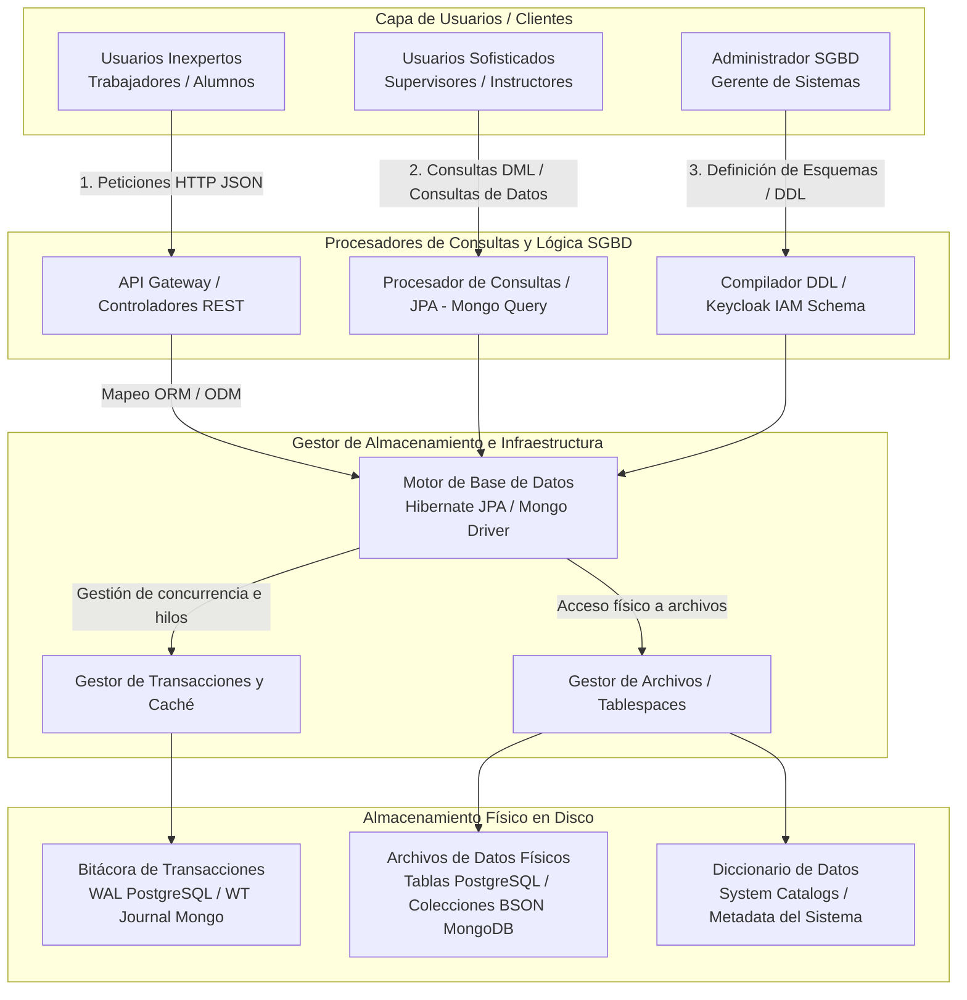

# 3.1.7. Diagramas de Integración de Sistemas

Esta sección describe y fundamenta la integración global del ecosistema de la plataforma **SafeIndustrial**, estructurándose en tres niveles de interacción: la capa de interacción del usuario (**Front-End**), la capa de procesamiento y lógica distribuida (**Backend**) y la capa de almacenamiento y persistencia (**Base de Datos**).

A continuación se presenta el diagrama de integración general y la sustentación técnica de cada componente.

### Diagrama General de Integración de Sistemas

```mermaid
graph TD
    subgraph A. Capa Front-End (Interacción)
        Web[Cliente Web React / Next.js]
        Mobile[Cliente Móvil Android / iOS]
    end

    subgraph B. Capa Backend (Ecosistema Microservicios)
        Gateway[api-gateway<br>Spring Cloud Gateway]
        Eureka[discovery-server<br>Netflix Eureka]
        Keycloak[Keycloak Server<br>OAuth2 / IAM]
        Broker[RabbitMQ Broker<br>Mensajería Asíncrona]
        
        US[user-service]
        SS[safety-service]
        CS[course-service]
        ES[exam-service]
        OS[order-service]
        PS[payment-service]
        CH[chat-service]
        NS[notification-service]
        PUR[purchase-service]
    end

    subgraph C. Capa de Base de Datos y Almacenamiento
        DB_SQL[(PostgreSQL Server<br>RDBMS)]
        DB_NoSQL[(MongoDB Server<br>Document Store)]
        S3[(AWS S3 / S3 Object Store<br>Cloud Storage)]
    end

    %% Conexiones Front-End a Gateway
    Web -->|HTTP REST / WebSockets| Gateway
    Mobile -->|HTTP REST / WebSockets| Gateway
    
    %% Conexiones de Gateway e Infraestructura
    Gateway <-->|Balanceo y Registro| Eureka
    Gateway -->|Valida Token JWT| Keycloak
    
    %% Enrutamiento Backend
    Gateway --> US
    Gateway --> SS
    Gateway --> CS
    Gateway --> ES
    Gateway --> OS
    Gateway --> PS
    Gateway --> CH
    Gateway --> PUR

    %% Integraciones del Backend
    US <--> Keycloak
    SS -->|Publica Alertas EPP| Broker
    OS -->|Publica Transacciones| Broker
    ES -->|Publica Aprobaciones| Broker
    Broker --> NS
    
    %% Conexiones a Persistencia
    US -->|JPA / JDBC| DB_SQL
    SS -->|JPA / JDBC| DB_SQL
    ES -->|JPA / JDBC| DB_SQL
    OS -->|JPA / JDBC| DB_SQL
    PS -->|JPA / JDBC| DB_SQL
    PUR -->|JPA / JDBC| DB_SQL
    
    CS -->|Mongo Driver| DB_NoSQL
    CH -->|Mongo Driver| DB_NoSQL
    
    US -->|Carga Fotos de Perfil| S3
    SS -->|Guarda Evidencia Video| S3
    PUR -->|Guarda Actas Firmadas| S3
```

---

### Sustentación de los Componentes de Integración

*   **A. Componentes Front-End:** Representa la interfaz de usuario de la plataforma, dividida en dos plataformas nativas independientes. La aplicación web en **React/Next.js** está destinada a supervisores de seguridad, instructores y administradores generales para visualizar tableros de control (KPIs), configurar exámenes y autorizar compras. La aplicación móvil en **Android/iOS** proporciona a los trabajadores mineros un canal ágil para consultar su puntaje de seguridad (`safety-score`), recibir alertas automáticas, rendir evaluaciones de seguridad y firmar actas de recepción de equipos (EPP) mediante su firma biométrica/digital.
*   **B. Componentes Backend:** Implementados bajo un enfoque de microservicios con **Spring Boot 4.0.6**, desacoplados físicamente y coordinados a través de **Spring Cloud Gateway** para centralizar la seguridad de las rutas, y **Netflix Eureka** para el descubrimiento de servicios dinámicos. La gestión de identidad y autorización está delegada a **Keycloak** (OAuth2/OpenID Connect) para asegurar el control de accesos basado en roles (RBAC). Las comunicaciones asíncronas de eventos se realizan mediante el broker **RabbitMQ**, el cual encola alertas de incidentes e hitos transaccionales para que el servicio de notificaciones (`notification-service`) envíe alertas push o correos con mínima latencia y sin bloquear las operaciones del negocio.

---

# 3.1.8. Arquitectura de Base de Datos

Esta sección detalla los componentes del **Sistema Gestor de Base de Datos (SGBD)** de la plataforma, fundamentado en una arquitectura híbrida de base de datos relacional y no relacional (SQL/NoSQL). Esto permite optimizar el almacenamiento según la estructuración de la información del negocio.

A continuación se presenta el diagrama de componentes del SGBD, adaptado del modelo clásico de **Korth (1995)**, adaptándolo al ecosistema híbrido del backend.

### Diagrama de Arquitectura del SGBD (Adaptación Korth 1995)



---

### Sustentación de los Componentes de Base de Datos

*   **C. Componentes Base de Datos:** El ecosistema de persistencia es híbrido, diseñado para garantizar consistencia y flexibilidad:
    *   **PostgreSQL (SGBDR):** Actúa como base de datos relacional principal. Almacena entidades estructuradas y transaccionales críticas que requieren estricto cumplimiento ACID (Atomicidad, Consistencia, Aislamiento y Durabilidad). Se utiliza para la gestión de usuarios, auditorías, facturación, órdenes de compra e inventario de EPP, mapeado en el backend mediante el ORM de **Hibernate/JPA**.
    *   **MongoDB (NoSQL Documental):** Administra datos semiestructurados con alta velocidad de lectura. Se aplica en el catálogo de cursos (`course-service`) para almacenar lecciones complejas con múltiples niveles de anidamiento y archivos multimedia, y en `chat-service` para la persistencia dinámica de conversaciones y foros de discusión, mapeado mediante **Spring Data MongoDB** (ODM).
    *   **Almacenamiento Cloud (AWS S3):** Aloja archivos binarios de gran tamaño (fotos de perfil, videos evidencia de incidentes capturados por IA y archivos PDF de actas firmadas digitalmente), almacenando en las bases de datos únicamente los enlaces seguros (URLs firmadas) correspondientes.
*   **Adaptación de la Arquitectura del SGBD (Korth):** Los procesadores del sistema interpretan las consultas del API Gateway, mapeando las sentencias DML (Data Manipulation Language) y DDL (Data Definition Language) de forma transparente. El gestor de almacenamiento coordina de forma segura las transacciones (mediante logs WAL en PostgreSQL y WiredTiger Journal en MongoDB) y el control de archivos en disco, aislando los datos de la infraestructura operativa y asegurando que las colisiones de concurrencia en la mina o planta se manejen sin pérdida de información.
