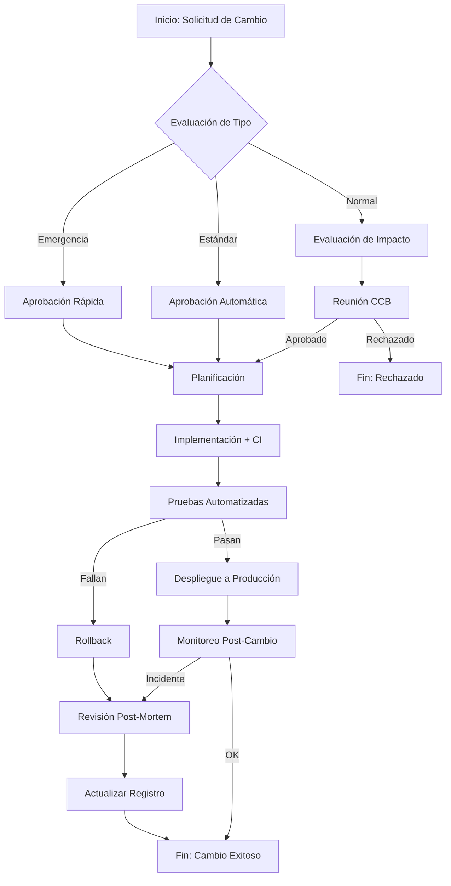

# Control de Cambios e Integración Continua (CI)

---

## PLAN DE CONTROL DE CAMBIOS

| Campo | Valor |
|-------|-------|
| **Nombre de la Organización – Empresa** | SafeIndustrial S.A. |
| **Proyecto** | Plataforma de Seguridad Industrial – Backend Integrador |
| **Responsable TIC** | [Nombre del Responsable] |
| **Fecha** | DD – MM – AAAA |
| **Versión** | 1.0 |

---

## 1. Objetivo del Plan

Establecer el proceso formal para **Solicitar, Evaluar, Aprobar, Implementar y Monitorear** cambios sobre la plataforma, garantizando la estabilidad, trazabilidad y calidad del servicio mediante integración continua (CI).

---

## 2. Alcance

| Área | Incluye |
|------|---------|
| Infraestructura | ECS, RDS, API Gateway, Keycloak, VPC |
| Aplicaciones | Microservicios (course-service, auth-service, etc.) |
| Bases de datos | MongoDB, esquemas, migraciones |
| Documentación | Diagramas, manuales, planes de prueba |
| Configuraciones | Variables de entorno, secrets, parámetros de infra |
| Calendarios de despliegue | Ventanas de release, freeze, emergencias |

---

## 3. Tipos de Cambio

| Tipo | Código | Descripción |
|------|--------|-------------|
| **Estándar** | `CHE01` – `CHE99` | Cambios pre-aprobados, bajo riesgo, repetitivos (ej. actualizar dependencias menores) |
| **Normal** | `CHN01` – `CHN99` | Cambios planificados con evaluación de impacto (ej. nueva funcionalidad, parche de seguridad) |
| **Emergencia** | `CHE01` – `CHE99` | Cambios críticos que requieren implementación inmediata (ej. hotfix de producción) |

---

## 4. Flujo de Control de Cambios (BPMN)

**Ilustración 1.** BPMN – Proceso de control de cambios para la integración continua.

---

## 5. Registro de Cambios

| Codificación | Cambio Solicitado | Impacto | Prioridad | Estado | Responsable |
|-------------|-------------------|---------|-----------|--------|-------------|
| CHN01 | Implementar auto-scaling en ECS | Alto | Alta | En Progreso | DevOps |
| CHE01 | Hotfix timeout en course-service | Medio | Crítica | Completado | Backend |
| CHE02 | Actualizar certificado SSL | Bajo | Media | Pendiente | Infra |

---

## 6. Evaluación de Impacto

| Área Afectada | Riesgo | Nivel |
|---------------|--------|-------|
| API Gateway | Alto: caída del gateway afecta todo el tráfico | Crítico |
| Base de Datos | Medio: migración mal aplicada puede causar inconsistencia | Alto |
| Documentación | Bajo: sin impacto operativo | Bajo |

---

## 7. Herramientas y Controles

| Herramienta | Propósito |
|-------------|-----------|
| **GitHub / GitLab** | Control de versiones, ramas protegidas, PRs |
| **GitHub Actions / Jenkins** | Pipeline de CI: build, test, lint, security scan |
| **SonarQube** | Calidad de código, deuda técnica |
| **Terraform / CloudFormation** | Infraestructura como código (IaC) |
| **Docker / ECS** | Contenerización y orquestación |
| **k6** | Pruebas de carga y rendimiento |
| **CloudWatch / Prometheus** | Monitoreo y alertas post-cambio |

---

## 8. Plan de Pruebas

| Tipo de Prueba | Responsable | Resultado Esperado | Evidencia |
|----------------|-------------|--------------------|-----------|
| Unitarias | Backend | > 80% cobertura | Reporte Jest / pytest |
| Integración | Backend | Endpoints responden OK | Postman / Supertest |
| Carga (k6) | QA/DevOps | SLO: p95 < 500 ms, error < 1% | Reporte k6 |
| Seguridad | DevOps | Sin vulnerabilities críticas | Trivy / SonarQube |
| Humo (Smoke) | DevOps | Deploy estable en staging | Pipeline log |

---

## 9. Plan de Rollback

| Escenario | Acción | Tiempo estimado |
|-----------|--------|-----------------|
| Falla en pruebas de CI | No desplegar; corregir en rama | N/A |
| Error después de deploy en staging | Revertir imagen Docker anterior | 5 min |
| Error en producción (normal) | `aws ecs update-service --desired-count` versión anterior | 10 min |
| Error en producción (emergencia) | Rollback automático vía pipeline + notificar CCB | 2 min |

---

## 10. Aprobaciones

| Fecha | Rol | Nombre | Firma |
|-------|-----|--------|-------|
| DD – MM – AAAA | Líder TIC | [Nombre] | [Firma] |
| DD – MM – AAAA | DevOps | [Nombre] | [Firma] |
| DD – MM – AAAA | QA | [Nombre] | [Firma] |
| DD – MM – AAAA | PM | [Nombre] | [Firma] |

---

> **Nota:** Este documento debe ser revisado y aprobado por el CCB (Change Control Board) antes de su adopción oficial. Las versiones actualizadas se mantendrán en el repositorio del proyecto bajo `docs/`.
